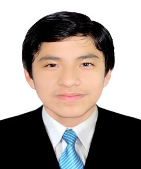

# This is my introduction

## Basics
⭐ My name is Luis Fernando Méndez.

⭐ I'm from Trujillo, Perú.

📚 Recently, I got into UTEC to study computer science.

This is me

#  Other stuff here
⚙️ Programming languages that I aldeady know a little bit tsss

C/C++

Python

⚙️ Things that I want to learn in the upcoming year

Data structures and algorithms

Solidity and smart contracts

ROS for programming robotics I guess

Etc...

Competitive programming is stressful : )

